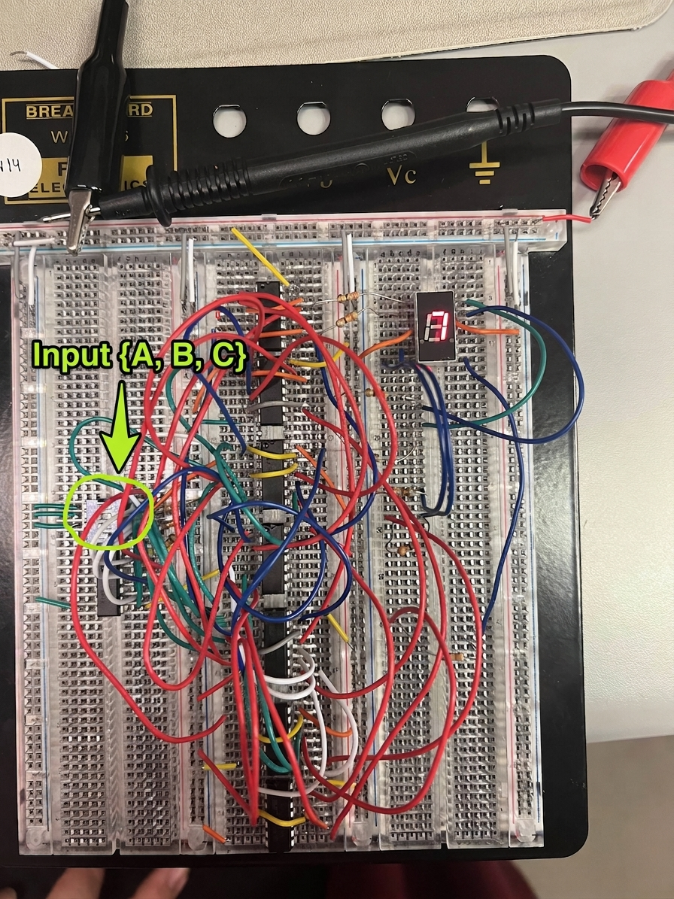
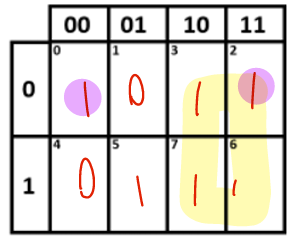
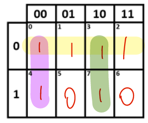
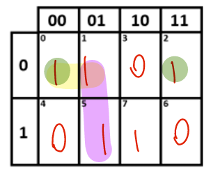
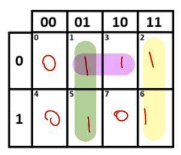
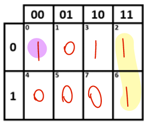
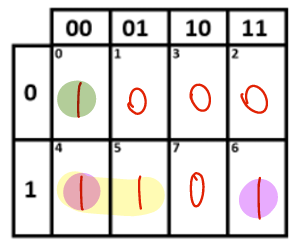
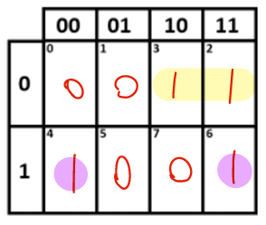

# Structural Verilog 3-to-7 Segment Decoder

A digital logic design project implementing an optimized 3-to-7 segment display decoder. This repository contains the structural SystemVerilog source code, simulation testbenches, Karnaugh map (K-map) optimization documentation, and physical breadboard hardware validation.

## Technical Specifications
* **HDL Language:** SystemVerilog (`.sv`)
* **Design Style:** Structural / Gate-Level Modeling
* **Optimization Method:** 3-Variable Karnaugh Maps (Sum-of-Products)
* **Hardware:** 7400-Series TTL Logic ICs (7404 NOT, 7408 AND, 7432 OR), DIP switches, Common-Anode 7-Segment Display

---

## Logic Optimization & Metrics

The standard canonical Sum-of-Products (SOP) expressions for outputs `a` through `g` were minimized using K-maps to reduce physical gate count and propagation delay prior to hardware construction.

* **Original Literal Inputs:** 140
* **Optimized Literal Inputs:** 54 (**61.4% reduction**)
* **Original Gate Count:** 45 gates
* **Optimized Gate Count:** 23 gates (**48.8% gate reduction**)

---

## Repository Structure

```text
├── src/
│   └── design.sv                # Structural Verilog gate-level code
├── testbench/
│   └── testbench.sv             # Testbench for output validation
├── docs/
│   └── kmap_derivations.pdf     # Complete K-map minimization proofs
└── images/
    ├── breadboard_testing.png   # Hardware verification photo
    ├── KmapA.png                # Segment A K-Map derivation
    ├── KmapB.png                # Segment B K-Map derivation
    ├── KmapC.png                # Segment C K-Map derivation
    ├── KmapD.png                # Segment D K-Map derivation
    ├── KmapE.png                # Segment E K-Map derivation
    ├── KmapF.png                # Segment F K-Map derivation
    └── KmapG.png                # Segment G K-Map derivation
```

---

## Hardware Validation

The optimized structural Verilog design was physically implemented on a breadboard using 7400-series TTL logic ICs and validated across all decimal inputs (0 through 7).

<p align="center">
  
  <br>
  <em>Figure 1: Physical TTL hardware implementation driven by DIP switch inputs and validated on a common-anode 7-segment display.</em>
</p>

---

## Karnaugh Map Derivations

All outputs were minimized using 3-variable Karnaugh Maps ($A, B, C$) in Sum-of-Products (SOP) form before hardware assembly.

### Minimal Boolean Expressions
* **Segment a:** $a = A + A'C'$
* **Segment b:** $b = A' + B'C' + ABC$
* **Segment c:** $c = A'B' + AC + A'C'$
* **Segment d:** $d = BC' + A'C + AB'C$
* **Segment e:** $e = C'B + A'B'C'$
* **Segment f:** $f = A(B'+C') + A'B'C'$
* **Segment g:** $g = A'B + AC'$

### K-Map Derivation Grids

<div align="center">

| Segment A | Segment B |
| :---: | :---: |
|  |  |

| Segment C | Segment D |
| :---: | :---: |
|  |  |

| Segment E | Segment F |
| :---: | :---: |
|  |  |

| Segment G |
| :---: |
|  |

</div>

---

## How to Run Simulation

1. Load `src/design.sv` and `testbench/testbench.sv` into your preferred SystemVerilog simulator (e.g., ModelSim, Vivado, EDA Playground).
2. Run the simulation testbench to print the truth table verification output to the console:

```text
 A B C | a b c d e f g
-----------------------
 0 0 0 | 1 1 1 1 1 1 0
 0 0 1 | 0 1 1 0 0 0 0
 0 1 0 | 1 1 0 1 1 0 1
 ...
```
